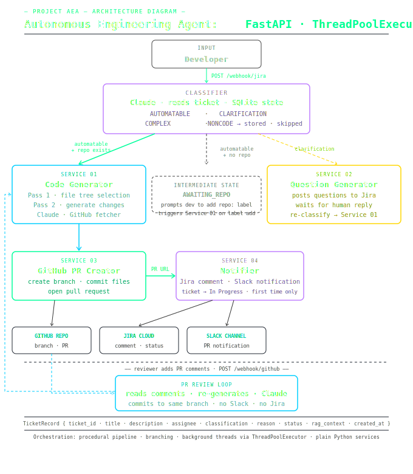

# Autonomous Engineering Agent (AEA)

> An AI-powered agent that reads Jira tickets and autonomously writes code and opens GitHub Pull Requests — with zero human intervention.

## Overview

AEA connects your Jira project management workflow directly to your GitHub codebase. When a developer creates a Jira ticket describing a feature or bug fix, AEA automatically classifies the ticket, asks clarifying questions if needed, reads the relevant parts of the codebase, generates code changes, and opens a Pull Request on GitHub — all without a developer writing a single line of code.

---

## Architecture

<p align="center">
  
</p>

### Orchestration

- **Single orchestrator** — procedural pipeline with branching, not a multi-agent framework
- **Background threads** via `ThreadPoolExecutor` for code generation and RAG indexing
- **State machine** — ticket status drives transitions: `AWAITING_CLARIFICATION` → `AWAITING_REPO` → `AUTOMATABLE`
- **DB persistence** — `TicketRecord { ticket_id · title · description · assignee · classification · reason · status · rag_context · created_at }`

---

## Key Details

### Classification Labels

| Label | Meaning |
|---|---|
| `AUTOMATABLE` | Clear, specific, small-scope — agent handles it autonomously |
| `CLARIFICATION` | Vague or missing requirements — agent asks questions in Jira first |
| `COMPLEX` | Large feature / multi-service — flags for human architecture review |
| `NONCODE` | Documentation, HR, process — no code change needed |

### Two-Pass Code Generation

**Pass 1 — File Selection:** Claude receives the full repository file tree (fetched live from GitHub) and the ticket description. It returns a list of the specific files it needs to read.

**Pass 2 — Code Generation:** Claude receives the full content of those selected files and generates a JSON diff of changes: which files to create or modify, and exactly what the new content should be.

The agent reads the codebase directly via the GitHub REST API — always working with the latest code.

### Repo & Branch via Jira Labels

- `repo:owner/repository-name` — tells AEA which GitHub repo to target
- `branch:branchname` — overrides the default `dev` target branch
- `aea-retry` — re-triggers code generation on any existing ticket

---

## Project Structure

```
aea/
├── app/
│   ├── main.py                        # FastAPI application & lifespan
│   ├── routes/
│   │   ├── webhook.py                 # POST /webhook/jira — full state machine
│   │   └── github_webhook.py          # POST /webhook/github — PR review loop
│   ├── services/
│   │   ├── classifier.py              # Claude ticket classification
│   │   ├── question_generator.py      # Claude clarifying question generation
│   │   ├── code_generator.py          # Two-pass code generation + review revision
│   │   ├── github_fetcher.py          # GitHub API: file tree + file content
│   │   ├── github_pr.py               # GitHub API: branch, commits, PR creation, review helpers
│   │   ├── jira_client.py             # Jira API: post comments, read comments
│   │   └── slack_notifier.py          # Slack Incoming Webhook notifications
│   ├── models/
│   │   └── ticket.py                  # Pydantic request/response models
│   └── db/
│       └── database.py                # SQLAlchemy engine, session, ORM model
├── .env                               # Environment variables (never commit)
├── .env.example                       # Template — copy and fill in your values
├── requirements.txt
└── README.md
```

---

## Tech Stack

- **FastAPI + uvicorn** — async webhook server
- **Claude (Anthropic / Azure)** — ticket classification, question generation, code generation
- **GitHub REST API** — file tree reading, branch creation, file commits, PR management
- **Jira REST API v3** — comment posting (ADF format), label reading, comment reading
- **SQLite + SQLAlchemy** — ticket state persistence
- **ngrok** — local tunnel for Jira webhook delivery during development

---

## Setup

### 1. Create and activate a virtual environment

```bash
python -m venv .venv
# Windows
.venv\Scripts\activate
# macOS / Linux
source .venv/bin/activate
```

### 2. Install dependencies

```bash
pip install -r requirements.txt
```

### 3. Configure environment variables

Copy `.env.example` to `.env` and fill in your real values:

```env
# Anthropic / Azure AI
ANTHROPIC_API_KEY=your-key-here
ANTHROPIC_BASE_URL=https://your-azure-endpoint.services.ai.azure.com/anthropic
ANTHROPIC_MODEL=claude-sonnet-4-5   # optional — defaults to claude-sonnet-4-5

# Database
DATABASE_URL=sqlite:///./aea.db     # or a PostgreSQL URL for production

# Jira
JIRA_WEBHOOK_SECRET=                # leave blank to skip signature verification
JIRA_BASE_URL=https://your-org.atlassian.net/
JIRA_EMAIL=you@example.com
JIRA_API_TOKEN=your-jira-token
JIRA_BOT_ACCOUNT_ID=your-bot-account-id

# GitHub
GITHUB_TOKEN=ghp_your-token-here
GITHUB_WEBHOOK_SECRET=              # leave blank to skip signature verification
GITHUB_REPO=                        # leave blank — repo comes from Jira labels
GITHUB_DEV_BRANCH=dev               # default PR target branch
GITHUB_BRANCH=main
GITHUB_REPO_PATH_FILTER=            # optional subfolder filter e.g. src/

# Slack
SLACK_WEBHOOK_URL=                  # Slack Incoming Webhook URL — leave blank to disable
```

### 4. Run the server

```bash
uvicorn app.main:app --reload --host 0.0.0.0 --port 8000
```

### 5. Expose locally with ngrok (for webhook delivery)

```bash
ngrok http 8000
```

Register webhooks in two places:
- **Jira:** `https://xxxx.ngrok.io/webhook/jira` — in your Jira project → Settings → Webhooks
- **GitHub:** `https://xxxx.ngrok.io/webhook/github` — in your GitHub repo → Settings → Webhooks (events: Pull request reviews, Pull request review comments)

---

## Usage

1. Create a Jira ticket with a clear description
2. Add a label `repo:owner/repository-name` to tell AEA which GitHub repo to target
3. AEA classifies the ticket — if automatable, it reads the codebase and opens a PR automatically
4. To retry: add `aea-retry` label. To target a different branch: add `branch:branchname` label.

---

## API Endpoints

### `GET /health`

```json
{ "status": "ok", "service": "AEA" }
```

### `POST /webhook/jira`

Receives `jira:issue_created`, `jira:issue_updated`, and `comment_created` events.

### `POST /webhook/github`

Receives GitHub `pull_request_review` and `pull_request_review_comment` events. When a reviewer requests changes, AEA reads all feedback, regenerates the affected files, commits the revision to the feature branch, and posts a confirmation comment on the PR.

---

## Interactive Docs

Once the server is running, visit:

- Swagger UI: <http://localhost:8000/docs>
- ReDoc: <http://localhost:8000/redoc>
